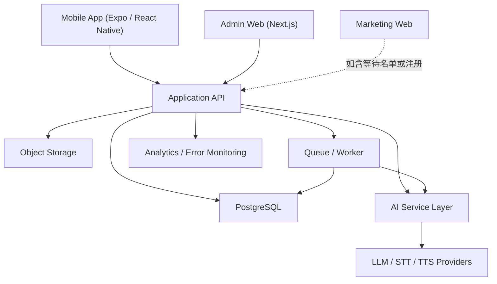

# LingoFlowAI 实施计划（执行版）

## 1. 文档目的

这份文档不再只是方向说明，而是后续多个 session 与多个工作流共享的执行主契约。

它要解决三件事：

1. 冻结当前阶段不会反复争论的关键决策。
2. 把 MVP 范围压缩到可交付的最小闭环。
3. 为后续并行开发提供稳定输入、阶段门槛和交接格式。

当前仓库仍以高保真原型为主，还没有正式应用代码，因此接下来的重点不是“还原所有页面”，而是先把执行顺序、数据边界和 AI 服务边界立住。

## 2. 已冻结结论

### 2.1 客户端与技术栈

- 学习端首版载体：`Expo + React Native + TypeScript`
- 路由：`Expo Router`
- 管理端：独立 `Next.js` Web 应用
- 营销站：独立轻量 Web 站点，可静态化或用 Next.js 轻站
- 后端：统一 `Application API`
- 数据库：`PostgreSQL`
- 鉴权：优先接入托管方案，如 `Supabase Auth`
- 监控：`Sentry + 产品埋点 + LLM 请求日志`

### 2.2 多端边界

- 完整学习闭环只在 `iOS / Android` 首版落地。
- `Admin Web` 保持独立，不并入移动端。
- `Marketing Web` 只承担获客、品牌、下载跳转、合规页面，不承载完整学习闭环。
- `Learner Web` 不进入 MVP 默认范围；只有在 `Phase 3` 文本场景练习稳定后，且书面定义能力差异后，才允许评估是否引入。

### 2.3 不可违反的架构原则

1. 页面层不直接调用模型 provider。
2. 所有 AI 行为都必须经过 `AI Service Layer`。
3. 所有模型请求都必须可追踪到用户、功能、模型、耗时、token、成本和结果状态。
4. 所有成长结论都必须能回溯到结构化的练习记录、错误分类或会话事件。
5. `Admin UI` 可以晚做，但成本治理与可观测性能力不能晚做。

## 3. 与 Design System 的执行关系

`stitch_insights/lingoflow_ai/DESIGN.md` 仍然是品牌和基础语义的来源，但执行上必须拆成两层：

### 3.1 全端强制

以下内容必须在学习端、管理端和营销站共用：

- 品牌主色与语义色
- 基础表面层级
- 字体规则
- 间距与圆角 token
- 主操作、次操作、危险操作的语义色

这些规则必须经共享 token 落地，禁止各应用手写零散十六进制色值。

### 3.2 仅学习端强制

学习卡片、AI 对话输入条、成就强调、教学向进度条等学习场景组件，只强制约束 `apps/mobile`。

### 3.3 Admin 例外

`Admin Web` 允许为了数据密度与可读性使用 token 化边框、表格分隔和高密度布局。

但仍必须遵守：

- 使用 token 内定义的表面层级
- 使用 token 内的 `outline-variant` 或同语义分隔色
- 不单独引入第二套品牌主色

换句话说，`Admin` 的例外是“组件与布局密度例外”，不是“品牌体系例外”。

## 4. MVP 范围冻结

首版只做一条可运行的学习闭环：

`登录 -> Onboarding -> Goal -> 今日任务 -> 练习 -> 结构化反馈 -> 简版洞察`

为防止范围膨胀，MVP 明确冻结为：

- 1 个学习目标 archetype
- 1 类练习类型
- 1 类文本场景对话
- 1 个主 provider / model routing 策略
- 文本优先，不做语音首发
- 洞察只做最近一段时间的摘要和建议，不做复杂长期预测

### 4.1 当前默认范围

若没有新的产品输入，当前默认按以下最小范围实施：

- 目标：通用英语提升
- 练习：单次生成、单次提交、结构化批改的文本练习
- 场景：文本回合制对话，支持结束后总结
- 洞察：基于最近练习与会话的弱项摘要、进步信号和下一步建议

### 4.2 明确不做

以下内容不进入 MVP：

- App 内完整语音练习链路
- 实时流式纠错
- 与 App 对等的 Learner Web
- 复杂营收系统与多套餐编排
- 多 provider 动态竞价式智能路由

## 5. 系统分层

### 5.1 执行口径

- `Application API` 负责鉴权、业务编排、数据访问和客户端契约。
- `AI Service Layer` 负责 Prompt 模板、结构化输出校验、provider 路由、降级策略和调用日志。
- `Queue / Worker` 负责异步任务，如报告生成、重算快照、转写等。
- `Object Storage` 在 MVP 中只为后续语音与附件预留，不作为首版核心交付。

## 6. 核心领域模型

本项目不能只靠 `users` 和 `messages` 起步。要从一开始建立“任务、活动、反馈、洞察”闭环。

### 6.1 用户与目标

- `users`
- `user_profiles`
- `learning_goals`
- `goal_milestones`

### 6.2 计划与完成事件

- `daily_learning_plans`
- `learning_plan_items`
- `activity_completions`

说明：

- `daily_learning_plans` 表示某天的任务集合。
- `learning_plan_items` 表示当天的具体学习活动，例如某次练习或某个场景任务。
- `activity_completions` 统一记录练习、场景、任务项完成结果，供 Dashboard 与 Insights 回溯。

### 6.3 内容与练习

- `exercise_templates`
- `generated_exercises`
- `exercise_items`
- `exercise_attempts`
- `attempt_feedback`

### 6.4 场景练习

- `scenario_catalog`
- `scenario_sessions`
- `scenario_messages`
- `scenario_turn_events`
- `scenario_feedback`
- `speech_artifacts` `# deferred`

说明：

- `scenario_turn_events` 用于记录回合级提示、状态切换和系统事件。
- `speech_artifacts` 只预留，首版不要求落地。

### 6.5 技能与错误分类

- `skill_frameworks`
- `skills`
- `error_types`
- `mastery_events`
- `skill_snapshots`

说明：

- `skills` 与 `error_types` 是洞察成立的前提。
- `attempt_feedback` 与 `scenario_feedback` 必须引用统一 taxonomy，而不是直接写自由文本。

### 6.6 洞察与报告

- `insight_snapshots`
- `weekly_reports`

### 6.7 AI 治理、配额与营收

- `llm_providers`
- `llm_models`
- `model_pricing_snapshots`
- `model_routing_policies`
- `feature_entitlements`
- `user_quotas`
- `quota_consumption_logs`
- `llm_requests`
- `subscription_plans` `# minimal`
- `user_subscriptions` `# minimal`
- `system_events`

说明：

- `model_pricing_snapshots` 用于保存调用当时的价格上下文，避免后续成本不可复算。
- `feature_entitlements` 与 `user_quotas` 区分“可用功能”和“剩余额度”。
- `subscription_plans` 与 `user_subscriptions` 只做最小版，为后续基础 revenue 面板留数据来源。

## 7. AI 能力拆分

AI 不作为“一个万能接口”实现，而是拆成用例明确的服务。

### 7.1 练习生成

输入：

- 用户目标
- 主题
- 技能方向
- 难度
- 历史薄弱项

输出：

- 题目
- 参考答案
- 评分 rubric
- 建议时长

### 7.2 练习批改

输入：

- 用户答案
- 题目上下文
- 评分 rubric

输出：

- 分数
- 错误类型
- 技能标签
- 改写建议
- 下一步建议

### 7.3 场景对话驱动

输入：

- 场景设定
- 用户水平
- 历史对话

输出：

- AI 回复
- 当前回合引导
- 会话状态信号

### 7.4 洞察生成

输入：

- 最近练习记录
- 错误分布
- 时间投入
- 目标状态

输出：

- 薄弱项总结
- 进步信号
- 下周建议

### 7.5 配额与模型路由

输入：

- 用户功能权限
- 用户额度
- 当前功能模块
- 路由策略

输出：

- 是否允许调用
- 使用哪个模型
- 是否触发降级
- 计费上下文

## 8. API 边界（首版）

API 仍按用例切分，不按页面切分。

### 8.1 鉴权与会话

- 若采用托管鉴权，密码与验证码流程可不由应用 API 自建。
- 应用 API 仍需统一：
  - 用户身份读取方式
  - Bearer / session 约定
  - 刷新策略
  - 客户端错误语义

### 8.2 用户与目标

- `POST /api/onboarding`
- `GET /api/dashboard`
- `POST /api/goals`
- `PATCH /api/goals/:id`
- `GET /api/goals/roadmap`

### 8.3 练习

- `POST /api/exercises/generate`
- `GET /api/exercises/:id`
- `POST /api/exercises/:id/submit`

### 8.4 场景对话

`Phase 3` 只支持文本回合制：

- `GET /api/scenarios`
- `POST /api/scenario-sessions`
- `POST /api/scenario-sessions/:id/message`
- `POST /api/scenario-sessions/:id/finalize`

首版不引入：

- WebSocket
- SSE
- 语音上传
- 实时转写

### 8.5 洞察

- `GET /api/insights/overview`
- `GET /api/insights/history`

### 8.6 运维与管理

即使 `Admin UI` 最后做，以下能力也必须提前存在：

- LLM 请求日志写入
- 配额检查
- 基础成本聚合视图
- 错误事件记录

`Admin UI` 首版接口可包括：

- `GET /api/admin/quotas`
- `GET /api/admin/llm/usage`
- `GET /api/admin/system/health`
- `GET /api/admin/revenue/overview`

## 9. 分阶段实施计划

### Phase 0：执行契约与基础骨架

目标：

把方向文档变成可执行基础，把移动端、共享契约和服务层边界先搭起来。

工作项：

- 固化 `Expo + React Native` 作为移动栈
- 修订实施计划、ADR、handoff、checklist
- 初始化项目骨架：
  - `apps/mobile`
  - `services/api`
  - `services/worker`
  - `packages/ui-tokens`
  - `packages/api-contracts`
- 接入基础鉴权占位、数据库连接、错误监控占位
- 建立 AI service shell、LLM 日志写入边界、quota guard 占位
- 编码设计 token
- App 启动后能打开基础空壳页面

产出物：

- 可执行实施计划
- `Phase 0` handoff
- `Phase 0` checklist
- Expo app skeleton
- API skeleton
- token skeleton

退出门槛：

- App 能在 `Expo Go` 或模拟器启动
- 路由和主题可用
- 页面代码不直接依赖模型 provider
- AI service shell 已存在
- 关键目录结构建立完成

明确延期：

- 真实 AI 能力接入
- 复杂业务页面
- 语音能力

### Phase 1：登录、目标初始化与规则型今日任务

目标：

让用户能完成登录、Onboarding、目标设定，并看到“今天学什么”。

工作项：

- 登录与基础会话流程
- Onboarding
- Goals
- Dashboard
- 规则型 daily plan 生成
- `daily_learning_plans`、`learning_plan_items` 落库

执行约束：

- `daily plan` 先按规则生成，不依赖 AI
- 页面可用 mock 数据，但契约要固定

退出门槛：

- 用户可完成首次进入、设置目标、看到 Dashboard
- 至少有一条可显示的今日任务
- 数据层已能区分“计划项”和“完成事件”
- handoff 中明确记录仍使用 mock 的地方

明确延期：

- AI 个性化任务生成
- 复杂成就系统

### Phase 2：练习 V1（单题型）

目标：

跑通 `generate -> submit -> structured feedback` 的最小练习闭环。

工作项：

- 接入一个主 provider / model
- 练习生成接口
- 练习提交接口
- 结构化批改结果
- `attempt_feedback` 引用 `skills` 与 `error_types`
- quota guard 正式接入
- LLM 请求日志落库
- 基础 AI eval 样本集
- 降级策略：
  - provider 失败时重试
  - 结构化输出失败时重试或回退模板

退出门槛：

- 至少一类练习可生成、作答、批改
- 100% AI 调用有日志
- 结构化输出经过 schema 校验
- 失败路径有明确降级
- 成本统计至少可通过 SQL 视图或内部报表查看

明确延期：

- 多题型
- 多 provider 智能路由
- 富媒体练习

### Phase 3：文本场景练习 V1

目标：

引入文本回合制场景对话，并在结束时输出结构化总结。

工作项：

- 场景选择页
- `scenario_sessions` 建立与恢复
- 文本回合制消息发送
- `scenario_turn_events` 记录回合级状态
- `finalize` 输出场景总结与反馈
- `scenario_feedback` 与 taxonomy 对齐

执行约束：

- 不做实时流式纠错
- 不做语音输入
- 不做音频存储

退出门槛：

- 文本场景会话可完整开始、继续、结束
- 会话总结可回写到洞察输入
- 所有回合和状态事件可追溯

明确延期：

- 语音链路
- 实时反馈
- 流式 transport

### Phase 4：洞察 V1

目标：

基于结构化学习数据给出可信的简版洞察。

工作项：

- 聚合最近练习与场景记录
- 生成 `skill_snapshots`
- 输出 `insights/overview`
- 生成简单的下一步建议

执行约束：

- 只基于最近一段时间的数据
- 不做复杂长期预测
- 不输出无法回溯的空泛结论

退出门槛：

- 每条洞察都能回溯到结构化证据
- 弱项、进步信号、下一步建议三类信息均可展示

明确延期：

- 长周期趋势预测
- 自动周报编排

### Phase 5：Admin Console 与 Marketing

目标：

把此前已经存在的数据能力做成可用的运营界面，并在需要对外获客时补齐最小营销站。

工作项：

- `Admin Web`：
  - 用户配额
  - LLM 调用与成本
  - 基础系统健康
  - 基础 revenue 视图
- `Marketing Web`：
  - 品牌落地页
  - 应用下载跳转
  - 隐私政策
  - 服务条款

执行约束：

- `Admin UI` 只消费前面阶段已经存在的数据能力
- 若尚未明确 GTM 时间线，则 `Marketing Web` 只保留最小占位

退出门槛：

- Admin 可查看关键运营数据
- Marketing 页面满足最小对外要求

## 10. 当前推荐执行顺序

如果从现在开始正式实施，顺序应为：

1. 修实施计划并冻结主契约
2. 建立 `Phase 0` 项目骨架
3. 进入 `Phase 1` 的登录、Onboarding、Dashboard、规则型 daily plan
4. 进入 `Phase 2` 的练习闭环
5. 再进入 `Phase 3` 的文本场景练习

注意：

- `AI Service Layer` 必须早于练习页面的正式 AI 接入
- `Admin UI` 可以晚于成本治理能力
- `Learner Web` 不得在 `Phase 3` 稳定前启动

## 11. 并行开发规则

本项目允许并行开发，但只允许在契约冻结后并行。

### 11.1 可并行的前提

- 共享 contract 已写清楚
- 写入边界明确
- handoff 文件已建立
- 合并验收责任人明确

### 11.2 当前推荐并行切分

在 `Phase 0` 之后，可按以下方式并行：

- Workstream A：`apps/mobile`
- Workstream B：`packages/ui-tokens`
- Workstream C：`services/api`

在 `Phase 2` 之后，可按以下方式并行：

- Workstream A：练习 UI
- Workstream B：AI service implementation
- Workstream C：日志、quota、成本聚合

### 11.3 当前不应并行的事项

- 在 schema 未定前并行写 API
- 在 AI service shell 未立前并行写 AI 页面逻辑
- 在 token 未编码前并行还原多个页面

## 12. Flow Engineering 交接要求

后续 session 不依赖聊天记忆，依赖仓库中的交接工件。

每个阶段结束前必须更新：

- `docs/handoffs/phase-x-handoff.md`
- `docs/tasks/phase-x-checklist.md`
- 必要时新增 `docs/adr/`

下一阶段开始前必须先读：

- 当前版 `docs/implementation-plan.md`
- 最近一个 handoff
- 当前阶段 checklist
- 相关 ADR

## 13. 当前状态与下一步

当前状态：

- 技术栈已定
- Flow Engineering 骨架已建立
- 实施计划已切换为执行版

下一步：

- 初始化 `apps/mobile`
- 建立 Expo app skeleton
- 建立 `services/api` skeleton
- 编码 `packages/ui-tokens`

在这些完成前，不进入正式功能开发。
