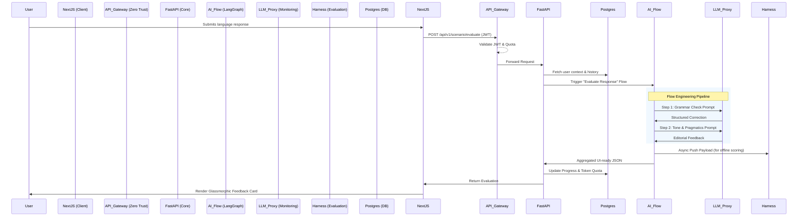

# LingoFlow AI: System Architecture Design (Phase 1)

> **Design Philosophy:** The Intelligent Atelier
> **Core Principles:** Zero Trust Architecture, Anti-Sycophancy AI Evaluation, Flow Engineering, Harness Engineering

## 1. Multi-Persona Architectural Debate

To ensure a robust, unbiased, and highly resilient system, we conducted an internal debate among three distinct architectural personas:

### Persona A: The Radical Frontend Architect (Focus: DX, UX, Performance)
**Argument:** "The `DESIGN.md` mandates a 'high-end, minimalist workspace' with heavy reliance on Glassmorphism, asymmetric layouts, and complex tonal shifts. We need a meta-framework that supports extreme CSS-in-JS or advanced Utility First styling with SSR/SSG capabilities to guarantee zero layout shift. Next.js App Router with Tailwind CSS (configured heavily for our specific design tokens) and Framer Motion for the 'elastic ease-out animations' is non-negotiable. For state management, we should use Zustand or Jotai. The backend should just be a thin GraphQL layer."

### Persona B: The Conservative Security & Data Expert (Focus: Zero Trust, Monitoring, Cost)
**Argument:** "Hold on. I'm looking at `admin_llm_monitoring`, `admin_revenue_activity_insights`, and `admin_user_activity_quotas`. This is a system processing sensitive user learning data and burning expensive LLM tokens. A thin backend is reckless. We need a hard separation of concerns.
1. **Zero Trust Gateway:** Every request, whether to the DB or the LLM, must be authenticated and rate-limited at the edge (e.g., Kong or Cloudflare API Shield).
2. **Data Governance:** PostgreSQL with Row-Level Security (RLS) is mandatory. User data and Admin telemetry must reside in separate schemas.
3. **Anti-Sycophancy:** We cannot trust raw LLM outputs. We need an evaluation layer (Harness Engineering) that intercepts AI responses, scores them for educational value (not just politeness), and logs metrics to the monitoring service before returning them to the client."

### Persona C: The Pragmatic AI/Product Expert (Focus: Flow Engineering, Iteration, Delivery)
**Argument:** "Both of you make valid points, but we need to ship a working product, not a theoretical masterpiece. The core value is the `ai_exercise_generator` and `scenario_practice`. We need **Flow Engineering**: structured, deterministic AI workflows rather than single 'prompt-and-pray' calls.
Let's use Python (FastAPI) for the backend. Why? Because the Python AI ecosystem (LangGraph, LiteLLM, DSPy) is unparalleled for building reliable AI agent flows. We can wrap the LLM calls in strict Pydantic schemas to guarantee the structured JSON needed by the complex UI cards. We'll use a task queue (Celery or temporal) for async exercise generation to avoid timeouts on the Vercel edge. We implement Harness Engineering via an offline evaluation pipeline (e.g., LangSmith or a custom RAGAS implementation) to continuously test the prompt effectiveness against golden datasets."

### Synthesis & Resolution (The Consensus Path)
*   **Frontend:** We accept the Architect's push for Next.js + Tailwind + Framer Motion. It's the only way to faithfully execute the 'Intelligent Atelier' design spec efficiently.
*   **Backend & AI:** We align with the AI Expert. A Python/FastAPI backend is essential for complex AI routing, Flow Engineering (using state machines for prompt chains), and data validation.
*   **Security & Infrastructure:** We integrate the Security Expert's Zero Trust model. Authentication sits at the API Gateway. LLM calls are routed through an AI Gateway (like LiteLLM proxy) for cost tracking, caching, and guardrails (Anti-Sycophancy/Hallucination checks).

---

## 2. System Architecture Overview

The system is divided into four major tiers:

### A. The Client Tier (The Intelligent Atelier)
*   **Framework:** Next.js (App Router) for hybrid rendering (SSR/CSR).
*   **Styling:** Tailwind CSS tailored to `DESIGN.md` (e.g., strict no-1px-borders, tonal shifts, custom spacing tokens).
*   **Animation:** Framer Motion for fluid, un-gamified transitions.
*   **Role Separation:** Distinct routing for User Experience (`/app/*`) and Admin Dashboards (`/admin/*`).

### B. The Zero Trust API Gateway Tier
*   **Component:** Kong API Gateway or native cloud API Gateway (e.g., AWS API Gateway / Cloudflare).
*   **Responsibilities:**
    *   JWT validation and RBAC (Role-Based Access Control).
    *   Strict rate limiting based on user quotas (`admin_user_quota`).
    *   Routing traffic to specialized microservices.

### C. The Application Services Tier (Python / FastAPI)
*   **Core API (FastAPI):** Handles business logic, user profiles, goals (`goals_priority`), and learning progress (`learning_insights`).
*   **AI Orchestration Engine (Flow Engineering):**
    *   Uses **LangGraph** or custom state machines to break down complex tasks (like `ai_exercise_generator`) into multi-step, deterministic workflows (e.g., *Draft -> Critique -> Refine -> Output*).
    *   Enforces structured outputs using **Pydantic**.
*   **LLM Gateway / Monitor:**
    *   Uses a proxy (e.g., LiteLLM) to route requests between providers (OpenAI/Anthropic), handle fallbacks, and track token usage per user for the `admin_llm_monitoring` dashboard.

### D. The Data & Evaluation Tier (Harness Engineering)
*   **Relational DB:** PostgreSQL (Supabase or AWS RDS) with RLS for relational data (Users, Progress, Admin Metrics).
*   **Vector DB (Optional):** Qdrant or Pinecone for semantic search in RAG pipelines (scenario context).
*   **Telemetry & Harness:**
    *   Redis for caching, rate limiting, and ephemeral quota tracking.
    *   **Evaluation Harness:** An async pipeline that logs AI inputs/outputs, evaluates them against rubrics (Anti-Sycophancy: "Did the AI correct the user strictly, or just agree with them?"), and stores metrics for the Admin Dashboards.

---

## 3. High-Level Interaction Flow (Scenario Practice)

## 4. Key Engineering Practices

### 4.1 Flow Engineering over "Prompt Engineering"
Instead of relying on monolithic mega-prompts, the `ai_exercise_generator` will use deterministic pipelines.
*   **Extract Phase:** Identify the user's weak points from `learning_insights`.
*   **Draft Phase:** Generate raw exercise content.
*   **Self-Correction Phase (Anti-Sycophancy):** A secondary LLM call evaluates the draft: "Is this exercise too easy? Is it blindly validating the user's previous mistake?" If yes, rewrite.
*   **Format Phase:** Coerce into strict JSON matching the Next.js component props.

### 4.2 Harness Engineering (Evaluation Driven Development)
We will maintain a suite of golden datasets (User input + Expected rigorous AI feedback). Every change to the AI pipeline must pass through an evaluation harness (e.g., Promptfoo or RAGAS) before deployment to ensure the AI acts as an *Intelligent Atelier* tutor, not a sycophantic chatbot.

### 4.3 Zero Trust & Observability Data
The admin modules (`admin_system_monitoring`, `admin_revenue_activity_insights`) are not afterthoughts. They are deeply integrated. Every request passing through the API Gateway and LLM Proxy emits structured logs (OpenTelemetry) that feed directly into the materialized views powering these Admin UI screens.
